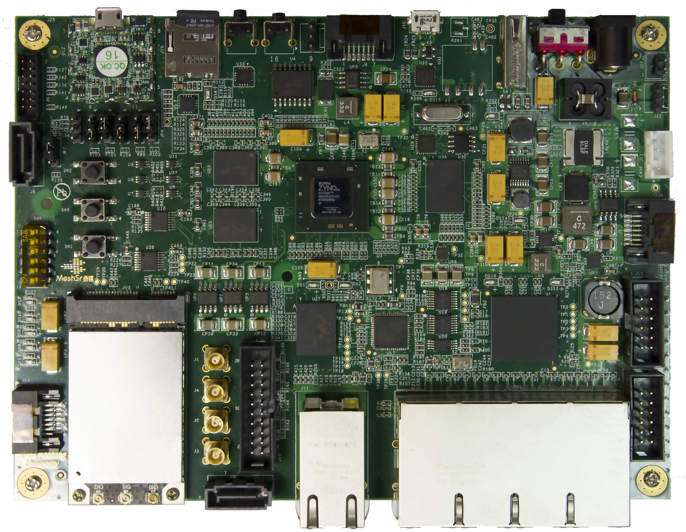
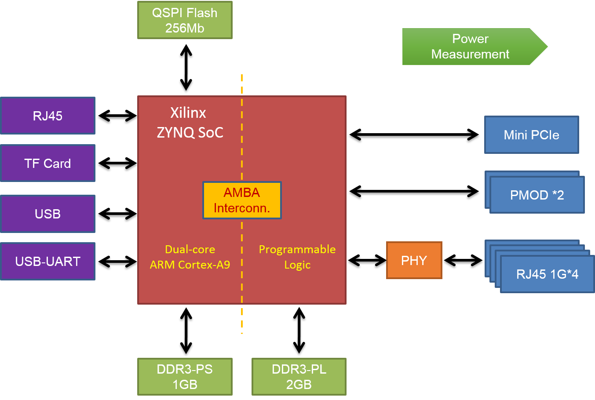
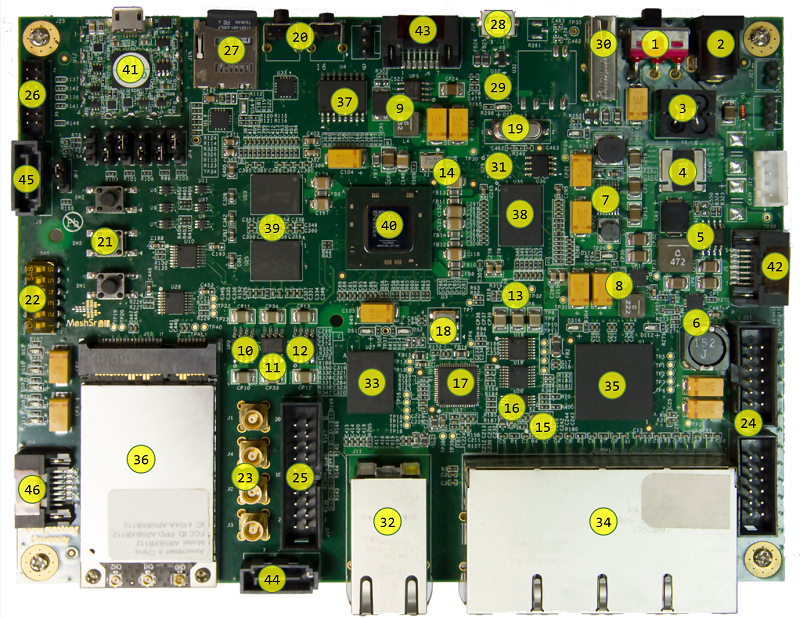
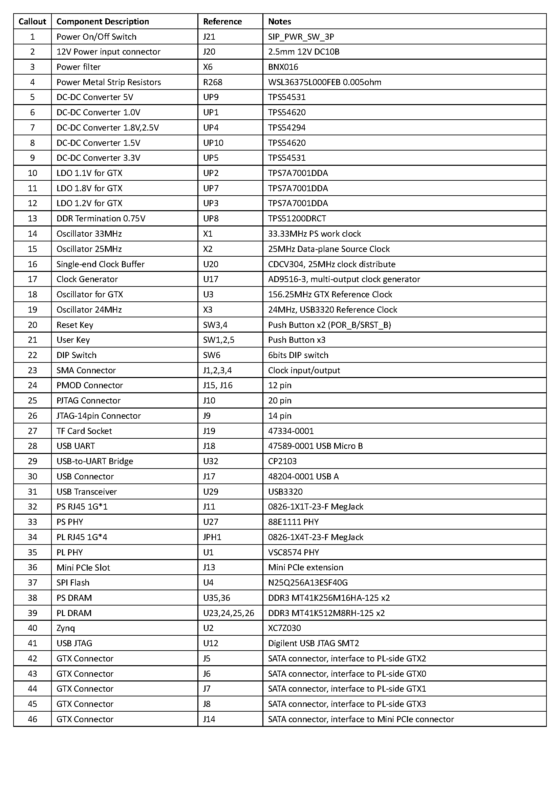

ONetSwitch30
=======
##Overview

**ONetSwitch30** is an All Programmable open networking innovation platform. 

**ONetSwitch30** is based on the Xilinx Zynq-7000 SoC, and mainly adopts the Gigabit ports. It can achieve a comprehensive experiment platform integrating calculations, storage, networks and interconnection by extension. Both its software and hardware can realize custom programming. Its reference designs are abundant and flexible, can be used to various researches on the evolution of network prototypes, and the development of customized network products. Especially, the features of the miniaturization and low power are adapted to the multi-node network tests and deployments.  

##Features  
* General
  * Main Silicon _XC7Z030-2SBG485_
  * Power Supply _DC 12V_
  * Primary Config. _TF card_
  * Auxiliary Config. _QSPI flash/JTAG_
* Processing System
  * Processor _Dual ARM Cortex-A9@800MHz_
  * Cache _(L1)32KB Inst. + 32KB Data per core; (L2)512KB; (OCM)256KB_
  * DRAM _DDR3 1GBytes_
  * Flash _Quad SPI flash 256Mb_
  * DMA _8 channel (4 for Programmable Logic)_
  * Ethernet _1x GE RJ45_
  * Peripherals _USB / USB-UART / USB JTAG / TF card_
* Programmable Logic
  * FPGA Logic _125K LCs, Kintex-7, ~1.9M ASIC gates_
  * Host I/F _AMBA AXI4 interconnect, max 100Gbps between PS-PL_
  * DRAM _DDR3 2GBytes_
  * Ethernet _4x GE RJ45_
  * Peripherals _2x PMOD_
  * User IO _user LEDs/push buttons/DIP switch_
  * Extension _mini PCIe for wireless NIC or SSD_

##Block Diagram  

  

##Board Layout  

  

  

##Specification
For details of the board hardware, please download the [ONetSwitch30 Hardware User Guide](https://github.com/MeshSr/wiki/blob/master/doc/msr-ons30-hwug.pdf).
