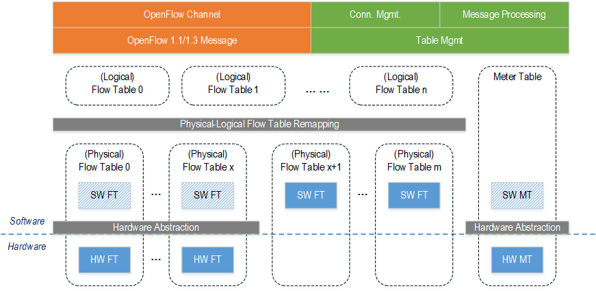
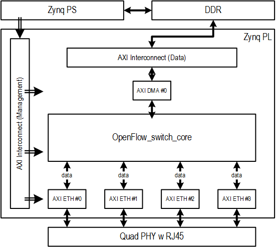
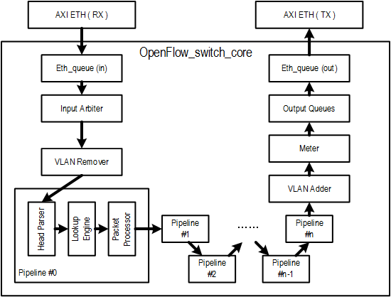
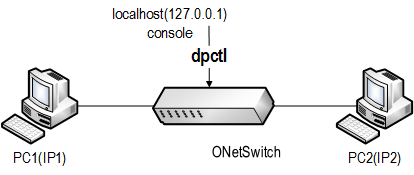

## Introduction

The OpenFlowSwitch(HWFT, with Hardware Flow Table) reference design provides a set of board-specific projects.  

This design achieves a hardware accelerated OpenFlow switch, using multiple stages of FPGA-implemented hardware flow tables, which are cascaded with software flow tables inside the vSwitch running in the CPU.  

_Demo runs at **Linux** level._  

###Features  
| Feature | Description |
| ------- | ----------- |
| Network STD.    | IEEE 802.3, IEEE 802.3u, IEEE 802.3ab |
| Physical Layer  | 1. 1000/100/10Mbps Copper RJ45|
|                 | 2. support Auto MDIX, support Auto Neg. |
| DataLink Layer  | 1. RGMII(ONS45 ONS20)/SGMII(ONS30) |
|                 | 2. support Promiscuous Mode (default promiscuous) |
|                 | 3. support MDIO management to all PHYs |
| Switch Method   | Mixed (Store-and-Forward in software, cut-through in FPGA) |
| Switch Rate     | Line rate, FPGA internal BW is 8Gbps |
| OpenFlow        | v1.3 |
| Flow Table      | Multiple, pipelined, default 64, max 3 impl. by FPGA |
| Meter Table     | Supported |
| Match Fields    | L2-L4 fields |
| QoS             | WRR queuing |
| Metadata        | Supported |
| VLAN            | Support tag-remove/add/modify |

###Project List  

[ons30-app52-ref_ofshw](https://github.com/MeshSr/onetswitch30/tree/master/ons30-app52-ref_ofshw)

###Pre-Built Images  
* For quick start demo.  

| File         | ONetSwitch20 | ONetSwitch30 | ONetSwitch45 |
| ----         |:------------:|:------------:|:------------:|
| boot.bin     |[`Download`](https://github.com/MeshSr/onetswitch20/blob/master/ons20-app52-ref_ofshw/ready-to-download/boot.bin) |[`Download`](https://github.com/MeshSr/onetswitch30/blob/master/ons30-app52-ref_ofshw/ready-to-download/boot.bin) |[`Download`](https://github.com/MeshSr/onetswitch45/blob/master/ons45-app52-ref_ofshw/ready-to-download/boot.bin) |
| devicetree   |[`Download`](https://github.com/MeshSr/onetswitch20/blob/master/ons20-app52-ref_ofshw/ready-to-download/devicetree.dtb) |[`Download`](https://github.com/MeshSr/onetswitch30/blob/master/ons30-app52-ref_ofshw/ready-to-download/devicetree.dtb) |[`Download`](https://github.com/MeshSr/onetswitch45/blob/master/ons45-app52-ref_ofshw/ready-to-download/devicetree.dtb) |
| kernel       |[`Download`](https://github.com/MeshSr/common-bin/blob/master/kernel/uImage) |[`Download`](https://github.com/MeshSr/common-bin/blob/master/kernel/uImage) |[`Download`](https://github.com/MeshSr/common-bin/blob/master/kernel/uImage) |
| rootfs (EXT) |[`Download`](https://github.com/MeshSr/common-bin/blob/master/rootfs/rootfs_ext4.tar.gz) |[`Download`](https://github.com/MeshSr/common-bin/blob/master/rootfs/rootfs_ext4.tar.gz) |[`Download`](https://github.com/MeshSr/common-bin/blob/master/rootfs/rootfs_ext4.tar.gz) |
| sw-lib       |[`Download`](https://github.com/MeshSr/common-bin/tree/master/lib) |[`Download`](https://github.com/MeshSr/common-bin/tree/master/lib) |[`Download`](https://github.com/MeshSr/common-bin/tree/master/lib) |
| sw-app       |[`Download`](https://github.com/MeshSr/common-bin/tree/master/ofs-hw) |[`Download`](https://github.com/MeshSr/common-bin/tree/master/ofs-hw) |[`Download`](https://github.com/MeshSr/common-bin/tree/master/ofs-hw) |

* For image assembling.

| File         | ONetSwitch20 | ONetSwitch30 | ONetSwitch45 |
| ----         |:------------:|:------------:|:------------:|
| system.bit   |[`Download`](https://github.com/MeshSr/onetswitch20/blob/master/ons20-app52-ref_ofshw/ready-to-download/res/onetswitch_top.bit) |[`Download`](https://github.com/MeshSr/onetswitch30/blob/master/ons30-app52-ref_ofshw/ready-to-download/res/onetswitch_top.bit) |[`Download`](https://github.com/MeshSr/onetswitch45/blob/master/ons45-app52-ref_ofshw/ready-to-download/res/onetswitch_top.bit) |
| dt source    |[`Download`](https://github.com/MeshSr/onetswitch20/blob/master/ons20-app52-ref_ofshw/ready-to-download/res/devicetree.dts) |[`Download`](https://github.com/MeshSr/onetswitch30/blob/master/ons30-app52-ref_ofshw/ready-to-download/res/devicetree.dts) |[`Download`](https://github.com/MeshSr/onetswitch45/blob/master/ons45-app52-ref_ofshw/ready-to-download/res/devicetree.dts) |
| fsbl         |[`Download`](https://github.com/MeshSr/common-bin/blob/master/fsbl/fsbl-ons20.elf) |[`Download`](https://github.com/MeshSr/common-bin/blob/master/fsbl/fsbl-ons30.elf) |[`Download`](https://github.com/MeshSr/common-bin/blob/master/fsbl/fsbl-ons45.elf) |
| u-boot (FAT) |[`Download`](https://github.com/MeshSr/common-bin/blob/master/u-boot/u-boot-ons20-ram.elf) |[`Download`](https://github.com/MeshSr/common-bin/blob/master/u-boot/u-boot-ons30-ram.elf) |[`Download`](https://github.com/MeshSr/common-bin/blob/master/u-boot/u-boot-ons45-ram.elf) |
| u-boot (EXT) |[`Download`](https://github.com/MeshSr/common-bin/blob/master/u-boot/u-boot-ons20-ext.elf) |[`Download`](https://github.com/MeshSr/common-bin/blob/master/u-boot/u-boot-ons30-ext.elf) |[`Download`](https://github.com/MeshSr/common-bin/blob/master/u-boot/u-boot-ons45-ext.elf) |
| rootfs (FAT) |[`Download`](https://github.com/MeshSr/common-bin/blob/master/rootfs/uramdisk.image.gz) |[`Download`](https://github.com/MeshSr/common-bin/blob/master/rootfs/uramdisk.image.gz) |[`Download`](https://github.com/MeshSr/common-bin/blob/master/rootfs/uramdisk.image.gz) |

* Additional init./config. script.

| File         | ONetSwitch20 | ONetSwitch30 | ONetSwitch45 |
| ----         |:------------:|:------------:|:------------:|
| script       |[`Download`](https://github.com/MeshSr/onetswitch20/blob/master/ons20-app52-ref_ofshw/ready-to-download/init.sh) |[`Download`](https://github.com/MeshSr/onetswitch30/blob/master/ons30-app52-ref_ofshw/ready-to-download/init.sh) |[`Download`](https://github.com/MeshSr/onetswitch45/blob/master/ons45-app52-ref_ofshw/ready-to-download/init.sh) |


###Block Diagram  
* System level  
**HW FT** = Hardware-implemented Flow Table  
**SW FT** = Software-implemented Flow Table  
We allow n stages of logical flow tables to be mapped into m stages of physical flow tables, in order to get better flexibility. The physical FTs can be either software-implemented or hardware-implemented.  
When implementing HW FTs, the hardware abstraction layer translates the software logic into the values of hardware registers.

  

* FPGA Diagram

  

###Design Outline  
> _More details coming soon.._  

####Core Design  
> _More details coming soon.._  

Notice the difference of priority level between software linked list and hardware TCAM.  

  

###Address Map  
####Base Address  
For Zynq PS address map, please refer to Appx. B of [Xilinx UG585](#).  
For MAC and DMA register offset and description, please refer to [Xilinx PG138](#) and [Xilinx PG021](#).  

| ONS20/30/45   | BaseAddr   | Notes |
| -----------   | --------   | ----- |
| axi_dma0      | 0x40400000 | |
| axi_ethernet0 | 0x43c00000 | eth1, MDIO master |
| axi_ethernet1 | 0x43c40000 | eth2 |
| axi_ethernet2 | 0x43c80000 | eth3 |
| axi_ethernet3 | 0x43cc0000 | eth4 |
| packet_pipeline | 0x48000000 | range to 0x48ffffff |

####Register Map  

####Register Description  

####Sample Configurations  

###Demo  
This is a demo without any controller in the scenario. Here's another page showing [how to run with RYU applications](https://github.com/MeshSr/wiki/wiki/Run-RYU-Builtin-App).  

* Prepare the images in SD/TF card, following the instructions [here](https://github.com/MeshSr/wiki/wiki/Run-RYU-Builtin-App).  
* Setup the topo like below.  

  

* Without connecting to any controller, manually send entries to enable the bidirectional communication between the two PCs.  

```bash
*** example ***

zynq> <ofsoftswitch-path>/utilities/dpctl tcp:127.0.0.1:6632 flow-mod cmd=add,table=0,prio=1 in_port=1 apply:output=2
zynq> <ofsoftswitch-path>/utilities/dpctl tcp:127.0.0.1:6632 flow-mod cmd=add,table=0,prio=0 in_port=2 apply:output=1

```  

* Ping each other, should get the response.
