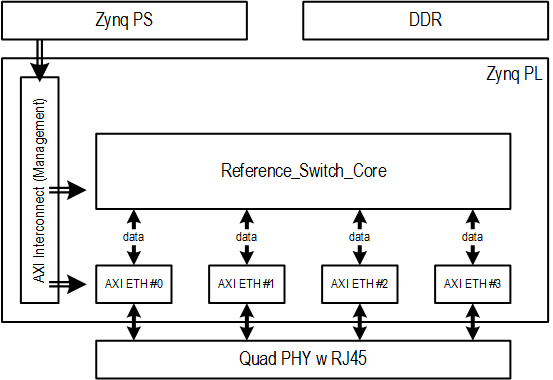
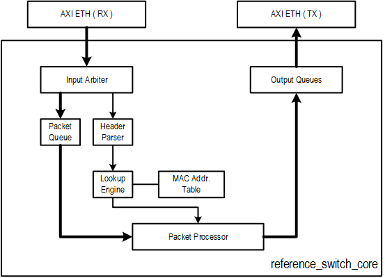

# Switch reference design on ONetSwitch30

##Intro  
The switch reference design provides a set of board-specific projects.  

This design implements a traditional Layer-2 switch at Zynq PL, running without Linux while status can be monitored by u-boot.  

_Demo runs at **u-boot** level._  

##Features  
| Feature | Description |
| ------- | ----------- |
| Network STD.    | IEEE 802.3, IEEE 802.3u, IEEE 802.3ab |
| Physical Layer  | 1. 1000/100/10Mbps Copper RJ45|
|                 | 2. support Auto MDIX, support Auto Neg. |
| DataLink Layer  | 1. RGMII(ONS45 ONS20)/SGMII(ONS30) |
|                 | 2. support Promiscuous Mode (default promiscuous) |
|                 | 3. support MDIO management to all PHYs |
| Switch Method   | Cut-through |
| Int. Bandwidth  | 8Gbps = 64bit * 125MHz |
| Packet Rate     | 5.95Mpps = 1.488Mpps/port * 4 port @1000Mbps |
| MAC Table       | 16 entries (for test only, can be set larger.) |

| Board | Project |
| ----- | ------- |
|ONetSwitch30|[ons30-app21-ref_switch](https://github.com/MeshSr/onetswitch30/tree/master/ons30-app21-ref_switch)|

##Pre-Built Images
* For quick start demo.

| File         | ONetSwitch30 |
| ----         |:------------:|
| boot.bin     |[`Download`](https://github.com/MeshSr/onetswitch30/blob/master/ons30-app21-ref_switch/ready-to-download/boot.bin)
| devicetree   | `N/A` | 
| kernel       | `N/A` | 
| rootfs (EXT) | `N/A` | 
| sw-lib       | `N/A` | 
| sw-app       | `N/A` | 

* For image assembling.

| File         | ONetSwitch30 | 
| ----         |:------------:|
| system.bit   |[`Download`](https://github.com/MeshSr/onetswitch30/blob/master/ons30-app21-ref_switch/ready-to-download/res/           onetswitch_top.bit) |
| dt source    | `N/A` | 
| fsbl         |[`Download`](https://github.com/MeshSr/common-bin/blob/master/fsbl/fsbl-ons30.elf) |
| u-boot (FAT) |[`Download`](https://github.com/MeshSr/common-bin/blob/master/u-boot/u-boot-ons30-ram.elf) |
| u-boot (EXT) |[`Download`](https://github.com/MeshSr/common-bin/blob/master/u-boot/u-boot-ons30-ext.elf) |
| rootfs (FAT) | `N/A` | 

* Additional init./config. script.

| File         | ONetSwitch30 | 
| ----         |:------------:|
| script       | `N/A` |[`Download`](https://github.com/MeshSr/onetswitch30/blob/master/ons30-app21-ref_switch/ready-to-download/res/   vsc8574-setup.tcl) |

##Block Diagram  

  

##Design Outline  
###Clocks  
| Freq.  | Description |
| ------ | ----------- |
| 125MHz | PS FCLK0. Main clock for data path, especially the AXI4-Stream. |
| 75MHz  | PS FCLK1. Main clock for control i/f, especially the AXI4-Lite. |
| 200MHz | PS FCLK2. Aux. clock for delay ctrl in ONS20/ONS45 RGMII. |
| 125MHz(LVDS) | For ONS30 ONLY, from AD9516-3 driving SGMII PCS/PMA. |

###Resets  
The system reset is from _Processor System Reset Module_ and synchronized with the slowest clock, normally the 75MHz PS FCLK1.  

###Interrupts  
Total 4. One interrupts per _AXI Ethernet_ i.e. MAC.

###Core Design  

  

##Address Map  
For Zynq PS address map, please refer to Appx. B of [Xilinx UG585](#).  
For MAC register offset and description, please refer to [Xilinx PG138](#).  

| ONS20/30/45   | BaseAddr   | Notes |
| -----------   | --------   | ----- |
| axi_ethernet0 | 0x43c00000 | eth1, MDIO master |
| axi_ethernet1 | 0x43c40000 | eth2 |
| axi_ethernet2 | 0x43c80000 | eth3 |
| axi_ethernet3 | 0x43cc0000 | eth4 |

##Demo  
* Prepare the images in SD/TF card, or download the pre-built ones.
* Connect two PCs to any two of the four ports, with IPv4 set in the same subnet.  
* Configure the registers inside PHY devices for initialization.  
  * (For ONS30) [vsc8574-setup.tcl](https://github.com/MeshSr/onetswitch30/blob/master/ons30-app21-ref_switch/ready-to-download/res/vsc8574-setup.tcl) should be used.  
* Ping each other, should get the response.
