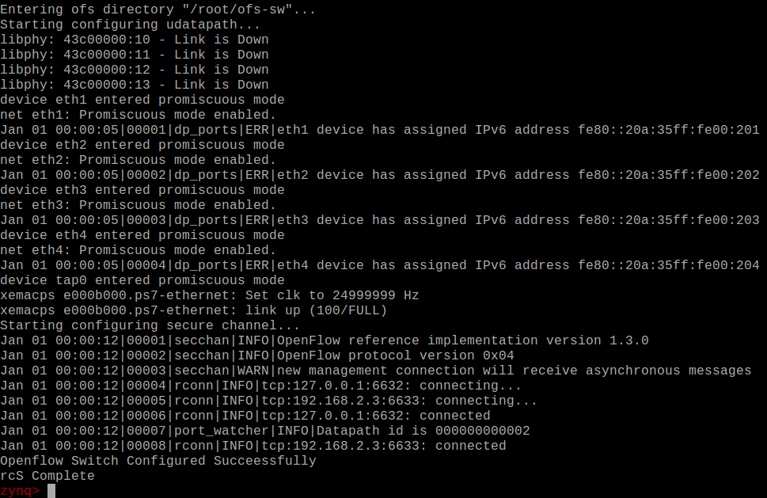
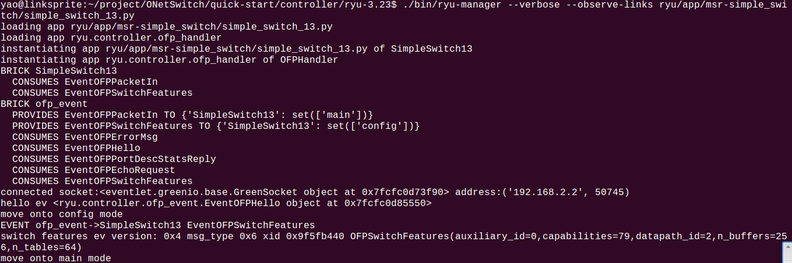

# Tips

## How to install ryu controller

### Download
```
git clone https://github.com/MeshSr/of-ctrl.git

```

### Install

1. Download the repo to your local position   
```bash
    mkdir git_repo
    cd git_repo/
    git clone https://github.com/MeshSr/of-ctrl
```
2. untar the Ryu-3.23 package to **proj_name**
```bash
    mkdir proj_name
    cd proj_name
    tar xvf git_repo/ryu/controller/Ryu-3.23.tar.gz
```
3. copy all the **app** to proj_name/ryu-3.23/ryu/app/
```bash
cp git_repo/of-ctrl/ryu/app/* proj_name/ryu-3.23/ryu/app/ -rf
```
4. install ryu
```bash
    sudo apt-get install python-pip    # need pip tools
    cd proj_name/ryu-3.23/
    sudo python setup.py install
```

### Run ryu manager
**On ONetSwitch Side**
* Connect ONetSwitch into network
* Put [ready to download](https://github.com/MeshSr/onetswitch30/tree/master/ons30-app51-ref_ofssw/ready-to-download) into FAT partition of your SD card, that inludes boot.bin, devicetree.dtb and init.sh.
* Put [uImage file](https://github.com/MeshSr/common-bin/tree/master/kernel) into FAT partition of your SD card.
* Uncomparess [rootf.tar.gz](https://github.com/MeshSr/common-bin/tree/master/rootfs) and put them into EXT4 partition of your SD card
* Put [ofs-sw tools](https://github.com/MeshSr/common-bin/tree/master/ofs-sw) into "/root" of EXT4 partition.


**Your PC Side**
Use your PC as openflow switch controller, make sure your PC and ONetSwitch are connected into one same network.
```
./bin/ryu-manager --verbose ryu/app/msr-simple_switch/simple_switch_13.py
```
According to the [init.sh](https://github.com/MeshSr/onetswitch30/tree/master/ons30-app51-ref_ofssw/ready-to-download), it says:
```bash
switch_ip=10.0.0.10
switch_netmask=255.0.0.0
gateway_ip=10.0.0.1
controller_ip=10.0.0.1
controller_port=6633
local_ip=127.0.0.1
local_port=6632
```
The **switch_ip** is the eth0 of ONetSwitch IP address, and the **controller_ip** is your PC's IP address which is used as controller.

Take my case, I change the default configuration as following:
switch_ip=192.168.2.2
switch_netmask=255.255.255.0
gateway_ip=192.168.2.1
controller_ip=192.168.2.3

### Put all together
After ONetSwitch start, it will shows the initialization of network, like:


And it will connect to controller.

At the same time, the controller will show the logs like:


Now the Openflow switch is connected to ryu controller.
