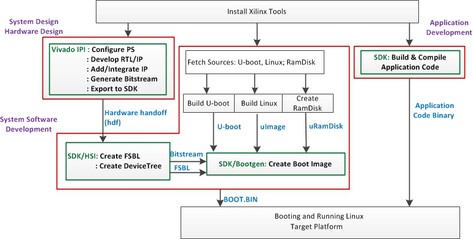

# workflow

## Overview  
A bottom-up approach is recommended when developing on the Xilinx Zynq SoC-based  ONetSwitch.  
The figure below from [Xilinx Wiki](http://www.wiki.xilinx.com/) shows a high level block diagram of the Xilinx design flow for Zynq AP SoC.  



For any layer or component in this hierarchy, you can either download the pre-built images for quick use, or modify then generate it by yourself in the way described below.  

## Get Prepared
* **Prepare the Boot Medium  **  
Xilinx Zynq SoC offers different types for system booting, on your demand.  
Here in the GitHub for an ONetSwitch, **the SD boot is chosen as default**. An FAT partition in the size of 512MB is used for storing the boot and kernel images, while an EXT partition typically larger than 1GB is for the root file system and the applications(e.g. OpenFlow switch software).  
For the detailed how-to, please refer to Xilinx Wiki [Prepare Boot Medium](http://www.wiki.xilinx.com/Prepare+Boot+Medium).  
* **Setup a Serial Console**    
It is a must to use the USB-UART when running an interactive program on the platform or debugging. Here's a helpful link on Xilinx Wiki [Setup a Serial Console](http://www.wiki.xilinx.com/Setup+a+Serial+Console).    
* **Get a Linux Environment**  
Software development on ONetSwitch requires a Linux environment for easy cross compilation.  
Ubuntu 12.04 LTS x86_64 may lack some needed 32-bit libraries. This can be fixed by installing `ia32-libs`.  
Ubuntu 14.04 LTS x86_64 may also lack some needed 32-bit libraries. This can be fixed by installing `libc6-i386`. 
* **Install Xilinx Tools**    
Xilinx Vivado and SDK must be installed for ONetSwitch development. 
[Download](http://www.xilinx.com/support/download.html)  
Notice that, by 2014 Q4, all our projects are developed with Vivado 2013.4.
When working in a Linux environment, especially for software developers, remember to setup the environment variables for cross compiler and the Vivado/SDK tools.  

```bash
export CROSS_COMPILE=arm-xilinx-linux-gnueabi-
source <path-to-installation>/Vivado/<version>/settings32.sh # OR
source <path-to-installation>/Vivado/<version>/settings64.sh
```

## Use Pre-Built Images  
The pre-built images can be fetched mainly from  
* **[common-bin](https://github.com/MeshSr/common-bin)**  
This repo stores the common FSBL, SSBL(u-boot), Linux kernel(uImage) and root file system(rootfs), as well as the SDN/OpenFlow executables. It is easy to find them in the repo according to the folder and file names.  
The boot loaders are board-dedicated, while the kernel image and the rootfs are applicable to all ONetSwitch boards.  
* **ready-to-download**  
This is a sub-folder associated with each project, usually contains the FPGA image(**system.bit**) and the project-specific devicetree blob(**devicetree.dtb**).  
The **boot.bin**, which is created by Xilinx SDK, always consists of the common FSBL and u-boot from common-bin above, and the project-specific system.bit.  

An example here to prepare for an OpenFlow software switch (ofs-sw) on ONetSwitch30 using pre-built images. 

You need to collect following items and make copies of them to the FAT partition.  

| File | Repo | Link |
| ---- | ---- | ---- |
| boot.bin | onetswitch30 | [ready-to-download/boot.bin]( https://github.com/MeshSr/onetswitch30/blob/master/ons30-app51-ref_ofssw/ready-to-download/boot.bin) |  
| devicetree | onetswitch30 | [ready-to-download/devicetree.dtb]( https://github.com/MeshSr/onetswitch30/blob/master/ons30-app51-ref_ofssw/ready-to-download/devicetree.dtb) |  
| kernel | common-bin | [kernel/uImage](https://github.com/MeshSr/common-bin/blob/master/kernel/uImage) |

You need also to extract the compressed rootfs to the EXT partition and then put the application images to somewhere in the extracted folder structure.  
In this example, some runtime libs are required so the sw-lib is copied as well.

| File | Repo | Link |
| ---- | ---- | ---- |
| rootfs (EXT) | common-bin | [rootfs/rootfs_ext4.tar.gz](https://github.com/MeshSr/common-bin/blob/master/rootfs/rootfs_ext4.tar.gz) |
| sw-lib | common-bin | [lib/*](https://github.com/MeshSr/common-bin/tree/master/lib)|
| sw-app | common-bin | [ofs-sw/*](https://github.com/MeshSr/common-bin/tree/master/ofs-sw) |

Notice that, all the boot.bin are prepared to start the kernel in the EXT partition, using the pre-built u-boot with suffix -ext.elf in its file name. If you want to simply run all in an FAT partition, rootfs as uramdisk and the u-boot with suffix -ram.elf.
The FPGA image should be used in the boot.bin regeneration.

| File | Repo | Link |
| ---- | ---- | ---- |
| system.bit | onetswitch30 | [ready-to-download/res/onetswitch_top.bit](https://github.com/MeshSr/onetswitch30/blob/master/ons30-app51-ref_ofssw/ready-to-download/res/onetswitch_top.bit) |
| fsbl | common-bin | [fsbl/fsbl-ons30.elf](https://github.com/MeshSr/common-bin/blob/master/fsbl/fsbl-ons30.elf) |
| u-boot (FAT) | common-bin | [u-boot/u-boot-ons30-ram.elf](https://github.com/MeshSr/common-bin/blob/master/u-boot/u-boot-ons30-ram.elf) |
| u-boot (EXT) | common-bin | [u-boot/u-boot-ons30-ext.elf](https://github.com/MeshSr/common-bin/blob/master/u-boot/u-boot-ons30-ext.elf) |
| rootfs (FAT) | common-bin | [rootfs/uramdisk.image.gz](https://github.com/MeshSr/common-bin/blob/master/rootfs/uramdisk.image.gz) |  

##Build the System
###Zynq Hardware Design
The Zynq hardware design generates the system.bit, defining the ARM CPU settings in Zynq PS and the FPGA bitstream in Zynq PL.  
* Create IP cores and hardware design
* Configure the processor
* Add and integrate IP cores
* Generate the bitstream
* Export the hardware design to SDK

The entire process is implemented in Xilinx Vivado tool. See more information in our [Hardware Design Guide](https://github.com/MeshSr/wiki/wiki/Guide-Hardware-Design).  

###Zynq Software Design
The Zynq software design introduces several steps to build up an entire embedded system, from boot loader to Linux kernel, including
* First stage boot loader, FSBL
* Second stage boot loader, SSBL, using u-boot
* Root file system, rootfs
* Device tree
* Linux kernel  

The process needs Xilinx SDK, and working environment in Linux with cross compiler installed. See more information in our [Software Design Guide](https://github.com/MeshSr/wiki/wiki/Guide-Software-Design).  

###Application Design
The applications, often the final target what we want, run on top of the OS (Linux as we mentioned above, or any others from 'bare-metal' to Android.)  
For SDN/OpenFlow application, we have done following and hope to get more from you.    
* A vSwitch running a CPqD ofsoftswitch13 ported to ARM [`ofs-sw`](https://github.com/MeshSr/ofs-sw)  
* An FPGA accelerated OFS, with both HW and SW flow tables [`ofs-hw`](https://github.com/MeshSr/ofs-hw)  


##Integrate and Test
###Prepare the Boot Image
The boot image, boot.bin, is created in Xilinx SDK, by assembling the FSBL, the FPGA image, and the SSBL in sequence.  
1. Select 'Xilinx Tools' from the SDK menu  
2. Choose 'Create Zynq Boot Image', a pop-up appears  
3. Add _fsbl.elf_, _system.bit_, _u-boot.elf_ sequentially  
4. Click 'Create Image' and wait for the generation  
5. Rename the output binary to _boot.bin_  

###Use the Test Sequence
Project-specific test sequence is provided as a demo. It mainly shows the usage of the board and the features of the application.  
Try the test sequence and check the results.  